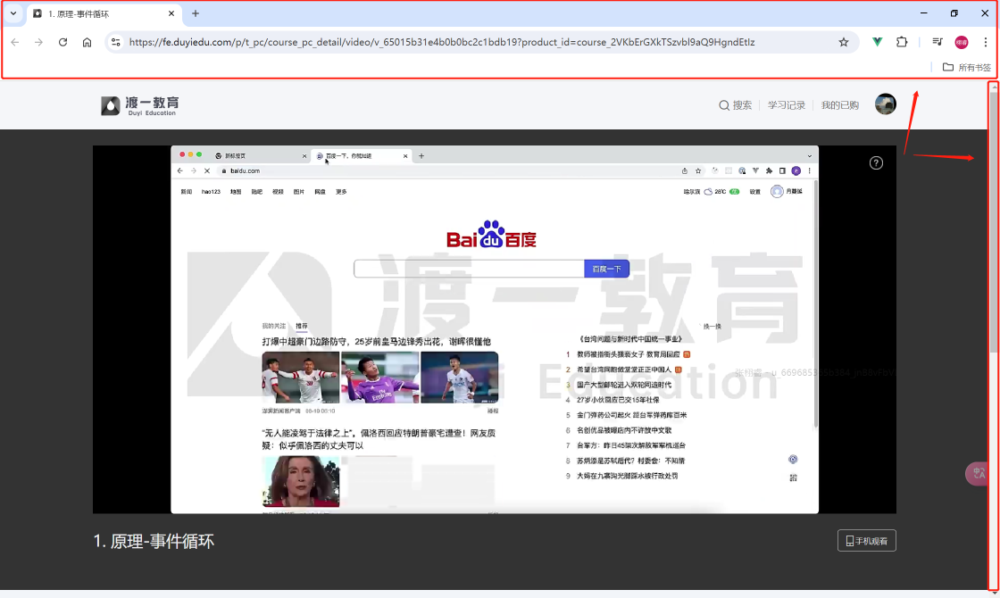
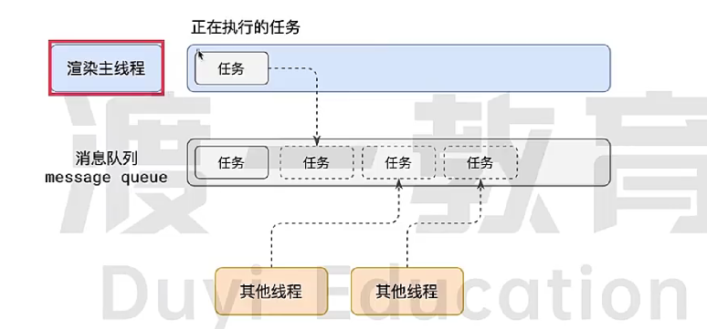

# 事件循环机制

## 进程和线程
一个进程是资源分配的最小单位，拥有自己独立的内存空间。一个进程内部可以有多个线程，每个线程负责不同的功能，但共享整个进程的所有内存空间。

一个进程至少有一个正在执行的线程，否则进程会被停止回收，释放内存资源。

## 浏览器
浏览器很复杂，是一个多进行多线程软件，不同进程各司其职负责不同的功能。 多进程保证了浏览器的各各功能不会因为某个进程崩溃而产生连锁的全盘崩溃。

常见的浏览器进程有浏览器进程、网络进程和渲染进程。打开chrome浏览器 => 点击右上角竖排三点标志 => 点击更多工具 => 点击任务管理器 => 就可以看到浏览器正在进行的进程。

浏览器进程是整个浏览器，也是浏览器软件的主进程。主要负责外壳界面展示（包括标签栏、网页前进后退、导航栏、插件、设置、书签等整个浏览器外壳）、用户交互事件监听（键盘事件、点击事件、滚轮事件）、子进程管理（网络进程、渲染进程）等功能，每个功能由内部的不同线程完成。

网络进程负责网络任务，网络请求的发送与接收等任务。

渲染进程主要负责解析html、css、js、每秒重绘页面60次等。

## 理解JS异步
JS本身是一个单线程语言，它只在一个线程上顺序执行，并不会有多线程操作。但是JS最常用的运行环境就是浏览器，即使是node环境也是将chrome浏览器的V8内核拿出来，让我们可以拜托浏览器来运行JS代码。

有了上面的认识后，再来谈JS的异步。单靠js本身是无法实现异步的，js只在单线程上顺序执行，如果js代码发送了网络请求，js无法再开辟一个线程来监听这个网络的返回值，然后再处理。如果想拿到网络请求的结果再进行操作，js只能在发送请求后原地等待网络请求的返回，再进行处理，这样浪费了大量事件。

渲染进程中有一个主线程负责解析html、css、页面刷新、js代码执行等功能，如果没有浏览器运行时环境，js发送一个网络请求后持续等待返回结果，导致单线程阻塞，页面无法进行刷新，无法响应用的点击，滚动事件，整个页面处于卡死状态。

为了解决这些问题，浏览器内核实现了事件循环。因此，理论上来讲事件循环和异步都不是JS本身自带的功能，而是浏览器内核提供的运行时环境自带的功能。同时像setTimeOut和setInterval等异步函数也不是JS本身实现的全局函数，而是浏览器提供的全局对象window的函数。

当渲染进程中的主线程执行js代码时遇到异步任务，浏览器会把这些任务交给对应的其他线程来进行持续的监听和处理，当有了结果后，将回调函数包装成任务送入消息队列，渲染进程主线程中的任务执行结束后，就会查询消息队列中的任务，并进行执行。

但是单纯说js没有异步感觉也不合适，因为JS和浏览器运行环境是分不开的，区别于浏览器运行环境的少数其他JS运行环境如Autojs实现网络请求就是同步的，会持续等待请求结果返回后再继续执行接下来的代码。

## 事件循环
渲染进程中的渲染主线程依次执行**执行栈**中的任务，其中的任务包括渲染html、解析css、执行js和刷新页面等任务。这些任务按照顺序依次执行。

同时还有一个消息队列，也叫事件队列。实际上消息队列是除了执行栈以外所有异步任务队列的总称，可能有多条任务队列，其中存放着不同类型的任务。**同一队列中的任务没有优先级，按照先进先出的顺序，而不同的队列有优先级，其中微任务队列优先级最高，主要由promise生成**

每当执行栈中的内容执行结束，就会**依次从优先级最高的消息队列中拿出任务**进行执行

